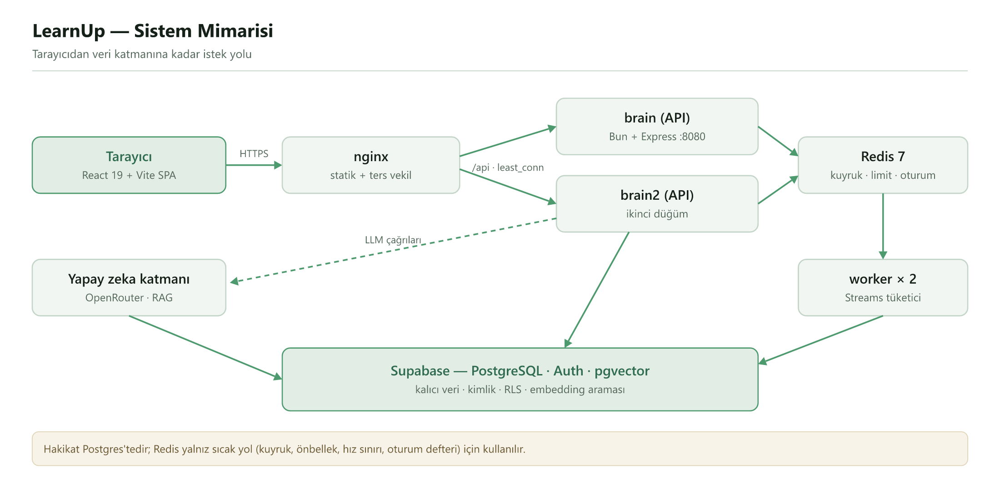
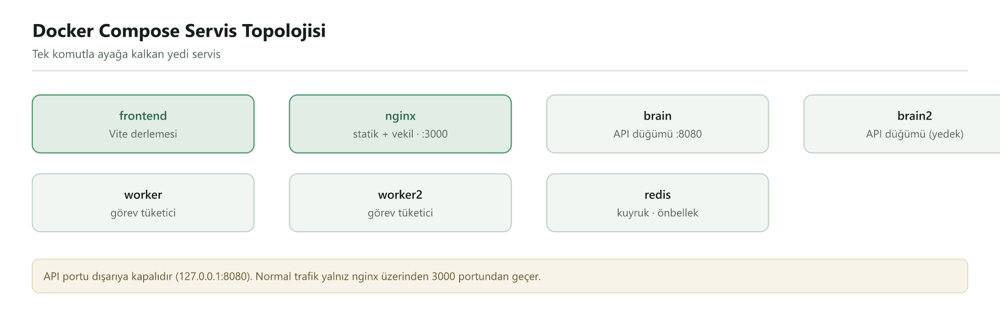
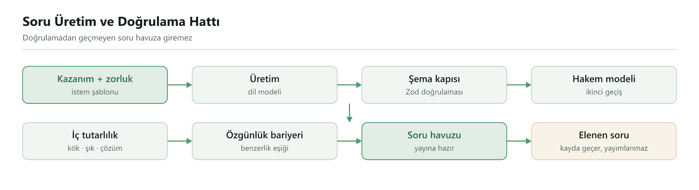
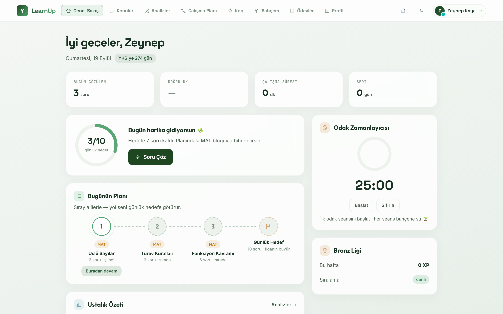
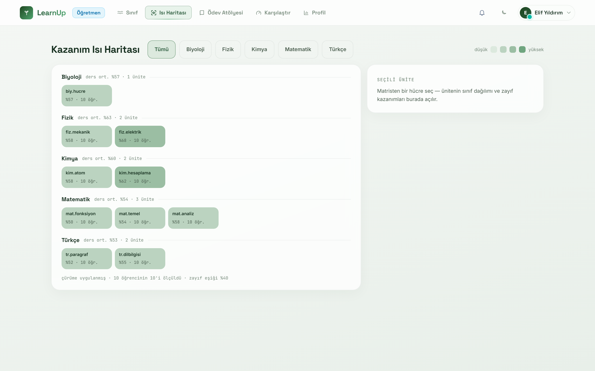

# LearnUp

LearnUp, kişiselleştirilmiş ve adapte olan dinamik öğrenme süreçleriyle öğrencilerin sınav maratonunu optimize eden tam teşekküllü bir YKS/LGS hazırlık platformudur.

Proje seti; React + Vite SPA mimarisine sahip frontend bileşenini, Bun/Express mimarisiyle güçlendirilmiş backend/worker mikroservislerini ve Supabase + Redis ile kurgulanmış esnek veri katmanını içeren ölçeklenebilir bir monorepo yapısıdır.

## İçindekiler

- [Genel Bakış](#genel-bakış)
- [Sistem Mimarisi](#sistem-mimarisi)
- [Neler Yapıldı](#neler-yapıldı)
- [Ekranlar](#ekranlar)
- [Teknoloji Yığını](#teknoloji-yığını)
- [Proje Yapısı](#proje-yapısı)
- [Ön Koşullar](#ön-koşullar)
- [Ortam Değişkenleri](#ortam-değişkenleri)
- [Docker Compose ile Çalıştırma](#docker-compose-ile-çalıştırma)
- [Yerel Geliştirme](#yerel-geliştirme)
- [Üretim ve Build](#üretim-ve-build)
- [Supabase ve Migrationlar](#supabase-ve-migrationlar)
- [Yardımcı Komutlar](#yardımcı-komutlar)
- [Sorun Giderme](#sorun-giderme)

## Genel Bakış

- `frontend-v2/` — React 19 + Vite 8 SPA. Build sonucu `nginx` tarafından sunulur.
- `learnup-brain/` — Bun tabanlı API sunucusu ve arka plan worker'ı.
- `supabase/` — Supabase projesine ait yapılandırma ve migration dosyaları.
- `docker-compose.yml` — Tüm servisleri (frontend, nginx, iki API düğümü, iki worker, Redis) tek komutla ayağa kaldırmak için yapılandırma.

## Sistem Mimarisi



İstek akışı:

1. Kullanıcı tarayıcıdan React/Vite SPA'ya erişir.
2. Nginx statik dosyaları sunar ve `/api` isteklerini iki API düğümüne (`brain`, `brain2`) `least_conn` ile dağıtır. Bu strateji, uzun açık kalan SSE sohbet bağlantılarının tek düğümde birikmesini önler.
3. Bun üzerinde çalışan Express API; kimlik doğrulama, yetkilendirme, iş mantığı, LLM çağrıları ve Supabase erişimini yönetir. API düğümleri durumsuzdur, bu yüzden yatay olarak çoğaltılabilir.
4. Uzun süren yapay zeka görevleri Redis Streams kuyruğuna yazılır; iki worker aynı consumer group üzerinden görevleri paylaşır. Görev sahiplenme CAS benzeri bir kontrolle yapılır, zamanlanmış işler Redis leader lock ile tek worker'da koşar.
5. Kalıcı veri Supabase Postgres'tedir (Auth, RLS, pgvector). Redis kalıcı veri deposu değildir; kuyruk, cache, hız sınırı ve oturum defteri için kullanılır.



### Backend katmanları (`learnup-brain/src`)

- `routes/` — API uçları; hem `/api` hem kanonik `/api/v1` yolları desteklenir.
- `middleware/` — `requireAuth` → `oturumKapisi` → `requireAktifHesap` → rol/kapsam kontrolü → hız sınırı zinciri.
- `agents/` — ajan modülleri ve Redis bus katmanı.
- `workers/` — arka plan worker süreci.
- `lib/` — soru üretimi, RAG, model yönlendirici, ustalık (mastery), planlayıcı, oturum ve yetki servisleri.
- `scripts/` — veri aktarımı, seed, eval, etiketleme ve bakım scriptleri.

### Frontend yapısı (`frontend-v2/src`)

- `App.tsx` — rol bazlı rota ağacı, lazy-loaded ekranlar.
- `screens/` — öğrenci ekranları; `screens/sinif/` öğretmen, `screens/kule/` yönetici ekranları.
- `lib/api.js` — Supabase oturumundan JWT alıp backend'e `Authorization: Bearer` ile gönderen API istemcisi.

## Neler Yapıldı

**Yapay zeka soru hattı.** Pratik soruları dil modeli üretiyor; ancak her soru öğrenciye ulaşmadan önce otomatik bir kalite hattından geçiyor: Zod şema kapısı, ikinci bir "hakem" modeliyle doğrulama, kök–şık–çözüm iç tutarlılık kontrolü ve benzerlik eşiğiyle çalışan özgünlük bariyeri. Doğrulanmayan soru havuza giremez, yalnız kayda geçer.



**RAG ve maliyet kontrolü.** pgvector ile bağlam getirme; hata durumunda sıradaki modele geçen model zinciri; zorluğa göre model seçimi (kolay/orta sorular ücretsiz modellere, zor sorular daha güçlü modele) ve günlük maliyet tavanı.

**Veri hatları.** 14 ders ve 907 MEB kazanımlık müfredat aktarımı; 2.210 ham kayıttan tekilleştirilmiş 1.730 çıkmış soru ve 1.695 sorunun zorluk etiketlemesi (kolay / orta / zor). Çıkmış sorular arayüzde yayımlanmaz, yalnız RAG bağlamı olarak kullanılır.

**Üç rol, üç panel.**
- Öğrenci: günlük plan, uyarlanabilir soru çözme, rota, konu haritası, yapay zeka rehberi, 3B bahçe, ödevler.
- Öğretmen: sınıf panosu, kazanım ısı haritası, öğrenci detay görünümü, ödev atölyesi, öğrenci karşılaştırma.
- Yönetici: kullanıcı ve sınıf yönetimi, soru havuzu, özgünlük denetimi, değiştirilemez denetim kaydı.

**Ölçeklenebilir altyapı.** Durumsuz iki API düğümü, nginx yük dengeleme, Redis Streams kuyruğu ve iki worker; toplam 7 servis Docker Compose ile ayağa kalkar.

**Güvenlik.** JWT/JWKS doğrulama, Supabase RLS, rol ve öğretmen kapsam kontrolü, Redis destekli oturum iptali, Helmet ve CORS kısıtları, üç kademeli hız sınırı (nginx IP limiti + Express'te standart, sohbet ve LLM profilleri). Rol alanı üzerinden yetki yükseltme açığı bulunup kapatıldı.

**Kalite.** GitHub Actions CI hattı (tip denetimi, lint, test, build) ve CI'da koşan 166 test. 84 bulguluk mantık hatası denetimi dört fazda kapatıldı. k6 ile katmanlı yük testi yapıldı (sağlık ucunda 600 istek/sn'de p95 5,8 ms, 0 hata).

## Ekranlar

| Öğrenci — günlük ekran | Öğretmen — kazanım ısı haritası |
| --- | --- |
|  |  |

## Teknoloji Yığını

- Frontend: React 19, Vite 8, TypeScript, Tailwind CSS 4, Radix UI, Framer Motion, React Three Fiber, Recharts
- Backend: Bun, Express, Zod, Supabase JS, OpenRouter, Redis (ioredis), jose, Pino
- Veri: Supabase Postgres, Supabase Auth, RLS, pgvector / embeddings
- Dağıtım ve kalite: Docker Compose (nginx, Bun, Redis), GitHub Actions, k6

## Proje Yapısı

- `frontend-v2/` — Tarayıcı tarafı uygulama
- `learnup-brain/` — API, worker ve server-side kod
- `learnup-brain/migrations/` — Supabase migration SQL dosyaları
- `supabase/` — Supabase proje yapılandırmaları ve destek dosyaları
- `docker-compose.yml` — Kök dizinde, tam stack geliştirme için

## Ön Koşullar

- Docker Desktop veya Docker Engine
- Bun (yerel geliştirme için önerilir)
- Git
- Supabase projesi ve uygun API anahtarları

## Ortam Değişkenleri

### Kök düzey `.env`

Kök `.env` dosyası, frontend build sırasında derleme zamanında kullanılacak `VITE_*` değişkenlerini içerir. Bu değerler tarayıcı bundle'ına gömülür.

- `VITE_SUPABASE_URL`
- `VITE_SUPABASE_ANON_KEY`
- `VITE_EDGE_FUNCTIONS_BASE_URL` (opsiyonel)

### `learnup-brain/.env`

Backend ve worker için sunucu tarafı ortam değişkenleri burada yer alır. Bu dosyada gizli anahtarlar bulunur.

- `PORT`
- `NODE_ENV`
- `SUPABASE_URL`
- `SUPABASE_SERVICE_ROLE_KEY`
- `OPENROUTER_API_KEY`
- `REDIS_URL`
- `APP_URL`

`service_role` anahtarı ve diğer gizli değerler yalnızca sunucu tarafında kullanılmalıdır.

### `frontend-v2/.env`

Bu dosya, frontend geliştirme sırasında Vite tarafından yüklenen `VITE_` değişkenlerini içerir. `frontend-v2` dizininde yer alan `.env.example` ve `.env` dosyaları yerel geliştirme için kullanılır.

## Docker Compose ile Çalıştırma

Kök dizindeki `docker-compose.yml`, frontend, brain, worker ve Redis servislerini tek seferde başlatmak için hazırdır.

```powershell
docker compose up --build
```

Çalıştıktan sonra erişim:

- Frontend: http://localhost:3000
- Brain API: http://localhost:8080

## Yerel Geliştirme

### Frontend

```powershell
cd frontend-v2
bun install
bun run dev
```

Bu, Vite geliştirme sunucusunu başlatır ve tarayıcıda canlı yenileme sağlar.

### Brain API

```powershell
cd learnup-brain
bun install
bun run dev
```

### Worker

```powershell
cd learnup-brain
bun run dev:worker
```

Backend için `learnup-brain/.env` dosyasını hazırlamayı unutmayın.

## Üretim ve Build

### Frontend Build

```powershell
cd frontend-v2
bun install
bun run build
```

### Docker Compose Üretim Benzeri Çalıştırma

```powershell
docker compose up --build
```

`frontend-v2` imajı, build sonucu `dist/` klasörünü nginx üzerinde servis eder.

## Supabase ve Migrationlar

Supabase migration dosyaları `learnup-brain/migrations/` dizininde yer alır. Bu dizin, veritabanı şeması değişiklikleri ve yeni kolon eklemeleri için SQL dosyalarını içerir.

## Yardımcı Komutlar

### `docker-compose`

- `docker compose up --build` — Tüm servisleri build ederek başlatır
- `docker compose down` — Çalışan servisleri durdurur ve ağı temizler

### Frontend

- `bun run dev` — Vite geliştirme sunucusunu başlatır
- `bun run build` — Üretim için frontend uygulamasını derler
- `bun run preview` — Build edilmiş frontend uygulamasını yerel olarak sunar

### Backend

- `bun run dev` — API sunucusunu geliştirme modunda başlatır
- `bun run start` — API sunucusunu üretim modunda başlatır
- `bun run dev:worker` — Worker sürecini başlatır

## Sorun Giderme

- `403` veya `401` hatası alıyorsanız, Supabase URL ve anahtarlarını kontrol edin.
- `docker compose` çalışmıyorsa Docker Desktop/Engine kurulumunu doğrulayın ve `docker compose version` komutuyla sürümü kontrol edin.
- `bun` ile ilgili sorun varsa yerel `bun` sürümünüzü kontrol edin veya Docker Compose üzerinden çalıştırmayı tercih edin.
- `frontend-v2` için kullanılan `VITE_*` değişkenleri sadece derleme zamanında bundle içine yazılır; bu nedenle gizli anahtarlar asla buraya konulmamalıdır.

## Notlar

- `frontend-v2` build sürecinde kullanılan `VITE_*` değişkenleri, tarayıcı tarafına gömüldüğü için sadece genel, public bilgiler içermelidir.
- `learnup-brain` backend servisi, `bun` kullanarak derleme olmadan direkt çalıştırılır.
- `worker` servisi, aynı `learnup-brain` imajını kullanır ancak `docker-compose.yml` içinde farklı bir komutla çalıştırılır.
